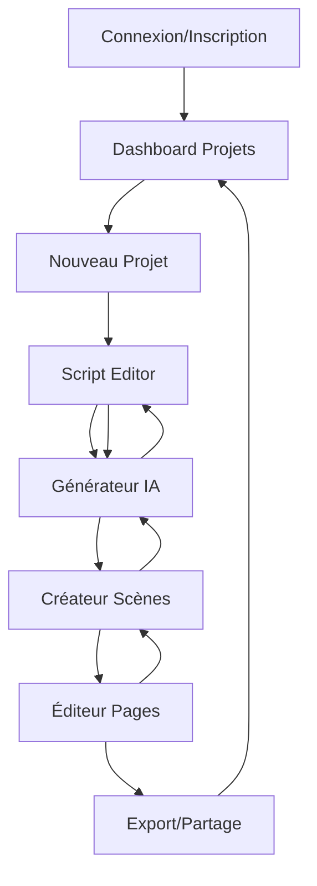
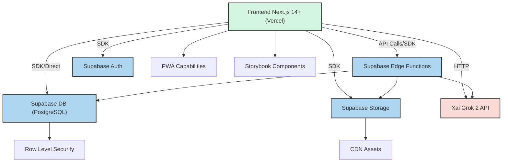

# Product Requirements Document (PRD) - MANGAKA AI

**Project Name:** MANGAKA AI
**Version:** 1.0
**Last Updated:** 19 Décembre 2024
**Author(s):** User (Initial Idea) & PRDarchitect (Elaboration)
**Key Stakeholders:** User, AI Coding Agent

**Preamble: Streamlined Workflow Approach**
Ce PRD est conçu pour un workflow rationalisé où l'input utilisateur principal est l'idée de projet centrale et les fonctionnalités désirées de haut niveau. L'Agent de Codage IA prendra des initiatives significatives pour proposer des détails techniques, éléments de design, et outils spécifiques. La stack Next.js et Supabase est suggérée par défaut, mais l'utilisateur aura le dernier mot sur le choix des technologies les plus appropriées.

---

## 0. AI Agent Onboarding and PRD Interpretation Protocol
*AI Agent Directive: Votre première tâche est de lire et analyser entièrement ce PRD pour comprendre sa structure, objectifs, et directives. Construisez une représentation interne des interdépendances entre sections. Familiarisez-vous avec la liste des serveurs MCP actuellement connectés et leurs outils principaux comme décrit dans la Section 5.6.1.*

---

## Table of Contents
1. [Introduction and Objectives](#1-introduction-and-objectives)
2. [Market and User Analysis](#2-market-and-user-analysis)
3. [Functional Requirements](#3-functional-requirements)
4. [Non-Functional Requirements](#4-non-functional-requirements)
5. [Design and Architecture](#5-design-and-architecture)
6. [Test and Validation Plan](#6-test-and-validation-plan)
7. [Deployment and Launch Plan](#7-deployment-and-launch-plan)
8. [Maintenance and Future Evolutions](#8-maintenance-and-future-evolutions)
9. [AI Agent Specific Instructions](#9-ai-agent-specific-instructions)
10. [Risks and Dependencies](#10-risks-and-dependencies)
11. [Glossary](#11-glossary)
12. [Appendices](#12-appendices)

---

## 1. Introduction and Objectives

### 1.1. Document Purpose
Ce document sert d'input principal pour l'Agent de Codage IA, qui élaborera les spécifications techniques basées sur l'input de haut niveau de l'utilisateur. Il décrit l'idée de projet MANGAKA AI, les fonctionnalités désirées, et établit le framework pour que l'IA propose des solutions détaillées dans le "Système de Codage Agentique".

### 1.2. Project Idea & Core Problem (User Input)
**Idée Centrale :** MANGAKA AI est une plateforme SaaS qui démocratise la création de manga en utilisant l'IA générative (Xai Grok 2) pour permettre aux jeunes passionnés de créer des manga/BD professionnels sans compétences en dessin.

**Problème Principal :** Les jeunes passionnés de manga/BD ont des histoires créatives à raconter mais sont bloqués par leur incapacité à dessiner. Les outils existants nécessitent des compétences artistiques avancées, créant une barrière d'entrée énorme pour la création de contenu manga/BD de qualité.

### 1.3. Product Vision (AI to Propose, User to Validate)
**Vision Produit :** Devenir la plateforme de référence mondiale pour la création de manga assistée par IA, transformant chaque passionné en mangaka capable de produire des œuvres de qualité professionnelle. MANGAKA AI vise à créer un écosystème créatif où l'imagination n'est plus limitée par les compétences techniques, permettant l'émergence d'une nouvelle génération de créateurs de manga.

### 1.4. Business Goals (AI to Propose based on Idea, User to Validate)
1. **Acquisition Utilisateurs :** Atteindre 10 000 utilisateurs actifs mensuels dans les 12 premiers mois
2. **Conversion Monétaire :** Obtenir un taux de conversion freemium → payant de 8-12% avec un ARPU de 19€/mois
3. **Leadership Marché :** Établir MANGAKA AI comme la référence en création manga IA avec 25% de part de marché dans le segment

### 1.5. Key Performance Indicators (KPIs) (AI to Propose, User to Validate)
1. **MAU (Monthly Active Users) :** 10 000 à 12 mois, 50 000 à 24 mois
2. **Taux de Conversion :** 8-12% freemium vers payant
3. **NPS (Net Promoter Score) :** >50 (excellent pour outils créatifs)
4. **Taux de Rétention 30 jours :** >40%
5. **Images générées par utilisateur/mois :** 25 images moyenne

### 1.6. Project Scope (AI to Propose based on Features, User to Validate)
**Dans le Scope Initial :**
- Générateur d'images IA optimisé manga/BD (personnages, décors, scènes)
- Créateur de scènes combinées (fusion personnages + décors)
- Éditeur de pages manga type Canva (cases, bulles, assemblage)
- Script editor pour organisation narrative
- Système d'authentification et gestion utilisateurs
- Modèle freemium avec crédits d'images
- Interface responsive (desktop prioritaire, mobile compatible)

### 1.7. Out of Scope (AI to Propose, User to Validate)
**Hors Scope Phase Initiale :**
- Marketplace de créations utilisateurs
- Collaboration temps réel multi-utilisateurs
- Export vidéo/animation
- Intégrations réseaux sociaux avancées
- Support multi-langues (français/anglais uniquement)
- Application mobile native
- Fonctionnalités de monétisation créateurs (commissions)

### 1.8. Guiding Principles for the AI Agent
- **Excellence en Design et UX/UI :** Produire des interfaces de qualité exceptionnelle, dignes des standards "Silicon Valley / Y Combinator"
- Adhérence stricte au Système de Design Agentique (Sections 5.1 & 5.2)
- Prioriser la clarté du code, maintenabilité, et testabilité
- Implémenter les meilleures pratiques de sécurité par défaut
- Optimiser pour la performance selon les NFRs (Section 4.1)
- Générer des tests complets (unit, integration, E2E)
- Proposer proactivement des solutions, librairies, serveurs MCP
- Communiquer les ambiguïtés promptement
- **Exploration Itérative :** Générer plusieurs alternatives pour composants UI, flux logiques
- **Conscience Contextuelle :** Comprendre le contexte projet global avant décisions

### 1.9. Agentic Coding System Overview
**Principes Fondamentaux :**
- **Excellence Technique :** Code propre, testé, performant, maintenable
- **Finesse Design :** Attention méticuleuse aux détails, expérience utilisateur polie et intuitive
- **Collaboration :** Intégration fluide entre exigences utilisateur et exécution IA
- **Documentation :** Génération assistée par IA de documentation complète
- **Itération :** Cycles de développement rapides basés sur feedback

### 1.10. Default Technology Stack & AI Initiative in Tooling
**Stack Technologique Suggérée :**
- **Frontend :** Next.js 14+ (avec TypeScript)
- **Backend/Database :** Supabase (PostgreSQL, Auth, Storage, Edge Functions)
- **Styling :** Tailwind CSS (avec Design System custom inspiré Shadcn/ui)
- **IA Génération :** Xai Grok 2 Image Gen API (0,07€/image)

L'Agent de Codage IA est habilité à :
1. Sélectionner des versions stables appropriées pour les éléments de stack
2. Identifier, rechercher, proposer et intégrer des librairies auxiliaires pertinentes, serveurs MCP
3. Exploiter extensivement les fonctionnalités Supabase si choisi
4. Documenter toutes les sélections et intégrations proposées

#### 1.10.1. Access to Project Context for AI Agent
L'Agent IA aura accès à :
- Le repository Git complet du projet (une fois initié)
- Fichiers de configuration clés (tailwind.config.js, tsconfig.json, package.json, next.config.js)
- Documentation Storybook existante
- Schémas de base de données (Supabase Studio)
- Documentation des MCPs connus/intégrés

### 1.11. AI-Human Interaction and Validation Protocol
**Mécanisme de Proposition :** L'Agent IA mettra à jour les sections pertinentes de ce PRD avec ses propositions détaillées
**Canal de Validation :** L'utilisateur reviewera et fournira feedback directement
**Résolution de Conflits :** Boucle de feedback itérative jusqu'à consensus
**Versioning PRD :** Incrément version mineure après chaque cycle validation significatif
**Attente de Validation :** L'Agent doit placer les tâches en état 'PENDING_VALIDATION' et attendre feedback explicite

---

## 2. Market and User Analysis

### 2.1. Market Research Summary
**Recherche de Marché Complétée :** Analyse approfondie réalisée et documentée dans `market_research.md`

**Conclusions Clés :**
- Marché manga : 66,2 milliards USD d'ici 2033 (+18,2% CAGR)
- Marché outils IA comics : 20,5 milliards USD d'ici 2034 (+23,4% CAGR)
- Segment cible sous-exploité : aspirants mangakas 16-25 ans
- Concurrence fragmentée sans leader spécialisé manga + IA + workflow intégré

### 2.2. Problem(s) to Solve
**Problèmes Spécifiques Identifiés :**
1. **Barrière technique insurmontable (90% aspirants créateurs) :** 7-10 ans apprentissage dessin, coût formation 15-50k€
2. **Processus création fragmenté (75% workflow actuel) :** Outils séparés génération → édition → assemblage → publication
3. **Incohérence stylistique :** Perte cohérence entre étapes, personnages non reconnaissables
4. **Coût prohibitif (80% budget concern) :** Illustrateur pro 50-200€/page vs 0,07€/image IA

### 2.3. Target Audience
**Audience Cible Primaire :** Aspirants mangakas 16-25 ans
- Passionnés manga/anime avec histoires à raconter
- Limités par compétences techniques en dessin
- Revenus limités (0-500€/mois), technophiles
- Actifs sur Reddit, Discord, TikTok, Instagram

**Audience Secondaire :** Créateurs de contenu digital 20-30 ans
- Influenceurs, YouTubeurs cherchant contenu visuel unique
- Focus monétisation vs passion pure création

### 2.4. User Personas

#### Persona 1: Akira - L'Aspirant Mangaka
- **Description :** 19 ans, étudiant littérature, passionné manga depuis enfance
- **Objectifs :** Concrétiser histoires en manga visuel, partager créations, potentiellement monétiser
- **Frustrations :** "J'ai 1000 histoires en tête mais je ne peux pas les dessiner", barrière financière, complexité outils pro
- **Scénario d'Usage :** Utilise MANGAKA AI pour créer 1 chapitre/semaine, partage sur réseaux sociaux, construit audience

#### Persona 2: Maya - La Créatrice de Contenu
- **Description :** 24 ans, influenceuse lifestyle 50k followers Instagram
- **Objectifs :** Contenu viral, cohérence brand, production rapide calendrier éditorial
- **Frustrations :** Besoin contenu original régulier, coût création visuelle élevé
- **Scénario d'Usage :** Crée mini-manga lifestyle pour stories Instagram, engage audience avec contenu unique

### 2.5. Competitive Analysis
**Concurrents Directs Analysés :**
1. **ComicsMaker.ai :** Généraliste, 5-15$/mois, style générique, fonctionnalités limitées
2. **Midjourney + Canva :** Workflow fragmenté, 22$/mois combiné, pas spécialisé manga
3. **Clip Studio Paint + IA plugins :** Complexe, 50$/an + plugins, courbe apprentissage 6+ mois

**Avantage Concurrentiel :** Premier outil IA spécialisé manga avec workflow intégré complet

### 2.6. Unique Value Proposition (UVP)
**"La première plateforme IA spécialisée manga qui transforme vos idées en manga professionnel en 30 minutes, sans savoir dessiner."**

**Différenciateurs Clés :**
- Spécialisation manga exclusive vs généralistes
- Workflow intégré complet vs solutions fragmentées
- Cohérence stylistique garantie vs incohérence outils séparés
- Pricing optimisé créateurs vs modèles coûteux

---

## 3. Functional Requirements

### 3.1. High-Level Feature List

#### 1. **Feature Name:** Générateur d'Images Manga/BD Optimisé (FEAT-001)
- **Objective/Description :** Générer personnages, décors et scènes avec prompts simples, boostés par prompts internes optimisés pour style manga/BD
- **Desired Vibe/Experience :** Magique, instantané, résultats impressionnants de qualité professionnelle
- **Key User Outcomes :** Obtenir visuels manga pro sans compétences dessin, débloquer créativité immédiatement

#### 2. **Feature Name:** Créateur de Scènes Combinées (FEAT-002)
- **Objective/Description :** Combiner plusieurs personnages et décors générés en une seule scène cohérente via prompt unifié
- **Desired Vibe/Experience :** Fluide, intuitif, créatif, comme assembler des LEGO narratifs
- **Key User Outcomes :** Créer scènes complexes et narratives facilement, maintenir cohérence stylistique

#### 3. **Feature Name:** Éditeur de Pages Manga (FEAT-003)
- **Objective/Description :** Assembler pages complètes avec cases, bulles dialogue, placement libre images générées (type Canva)
- **Desired Vibe/Experience :** Professionnel, flexible, satisfaisant, contrôle créatif total
- **Key User Outcomes :** Créer pages manga professionnelles publiables, workflow complet intégré

#### 4. **Feature Name:** Script Editor Structuré (FEAT-004)
- **Objective/Description :** Écrire et organiser scènes, panels, dialogues dans espace dédié pour structurer histoire
- **Desired Vibe/Experience :** Organisé, inspirant, productif, clarté narrative
- **Key User Outcomes :** Planifier efficacement manga avant création visuelle, structure narrative solide

### 3.2. User Stories

**FEAT-001 - Générateur d'Images :**
- En tant qu'aspirant mangaka, je veux générer un personnage manga en décrivant son apparence pour que je puisse visualiser mon héros sans savoir dessiner (Must Have)
- En tant que créateur de contenu, je veux générer des décors manga cohérents pour que mes histoires aient un cadre visuel professionnel (Must Have)

**FEAT-002 - Créateur de Scènes :**
- En tant qu'aspirant mangaka, je veux combiner mes personnages créés avec des décors pour que je puisse composer des scènes narratives complètes (Must Have)
- En tant qu'utilisateur, je veux maintenir la cohérence stylistique entre éléments pour que ma scène soit harmonieuse (Must Have)

**FEAT-003 - Éditeur de Pages :**
- En tant qu'aspirant mangaka, je veux assembler mes scènes en pages avec cases et bulles pour que je puisse créer un manga complet (Must Have)
- En tant qu'utilisateur, je veux contrôler la mise en page librement pour que j'exprime ma vision créative (Should Have)

**FEAT-004 - Script Editor :**
- En tant qu'aspirant mangaka, je veux structurer mon histoire avant création visuelle pour que mon manga ait une narration cohérente (Should Have)

### 3.3. Use Cases

**Use Case Principal - Création Manga Complète :**
1. Utilisateur se connecte et accède au dashboard
2. Crée nouveau projet manga dans Script Editor
3. Structure histoire (chapitres, scènes, dialogues)
4. Génère personnages principaux avec Générateur IA
5. Crée décors nécessaires pour l'histoire
6. Combine personnages + décors en scènes narratives
7. Assemble scènes en pages avec Éditeur Pages
8. Ajoute cases, bulles dialogue, effets visuels
9. Prévisualise et exporte manga final
10. Partage sur plateformes ou télécharge

### 3.4. User Flows

**Flow Principal - De l'Idée au Manga :**


### 3.5. Localization and Internationalization Requirements
**L10n/I18n Initial :** Français et Anglais uniquement pour MVP
- Interface utilisateur bilingue
- Messages d'erreur localisés
- Documentation utilisateur dans les deux langues
- Support UTF-8 pour caractères spéciaux

### 3.6. Preliminary API Design

**Endpoints Principaux :**
```
POST /api/generate-image
- Body: { prompt: string, style: 'character'|'background'|'scene', userId: string }
- Response: { imageUrl: string, imageId: string, creditsUsed: number }

POST /api/combine-scene
- Body: { characterIds: string[], backgroundId: string, scenePrompt: string }
- Response: { sceneImageUrl: string, sceneId: string }

POST /api/projects
- Body: { title: string, description: string, type: 'manga'|'comic' }
- Response: { projectId: string, createdAt: string }

GET /api/projects/:id
- Response: { project: ProjectData, pages: PageData[], assets: AssetData[] }
```

---

## 4. Non-Functional Requirements (NFRs)

### 4.1. Performance
**Critères de Performance :**
- Web Vitals (LCP, FID, CLS) dans la plage 'Good'
- Réponses API Supabase Edge Functions < 500ms sous charge normale
- Génération d'images IA < 30 secondes (dépendant Xai Grok 2)
- Transitions de pages instantanées
- Chargement initial application < 3 secondes

### 4.2. Scalability
**Critères de Scalabilité :**
- Exploiter la scalabilité inhérente de Supabase pour DB et auth
- Edge Functions écrites sans état pour scaling facile
- Cible : Gérer 1000 utilisateurs concurrent avec performance acceptable
- Auto-scaling infrastructure (Vercel + Supabase)
- CDN pour assets statiques et images générées

### 4.3. Security
**Critères de Sécurité :**
- Transmission données chiffrée via HTTPS
- Row Level Security (RLS) Supabase pour toutes tables pertinentes
- Gestion sécurisée mots de passe via Supabase Auth
- Protection contre OWASP Top 10 dans code custom
- Mises à jour régulières dépendances
- Validation input côté serveur pour tous endpoints
- Rate limiting sur API génération images

### 4.4. Reliability and Availability
**Critères de Fiabilité :**
- Cible 99.9% uptime (Vercel + Supabase)
- Gestion d'erreurs robuste et logging dans Edge Functions
- Sauvegardes automatisées Supabase
- Monitoring temps réel avec alertes
- Fallback gracieux si API Xai indisponible

### 4.5. Maintainability
**Critères de Maintenabilité :**
- Code adhérant aux styles définis Section 9.2
- Documentation code générée par IA (Section 9.4)
- Design modulaire (Atomic Design frontend, Edge Functions bien définies)
- Tests automatisés avec couverture >80%
- CI/CD pipeline automatisé

### 4.6. Usability and Accessibility (UX/UI & A11Y)
**Objectif UX/UI Supérieur :** Application offrant expérience utilisateur exceptionnellement intuitive, fluide et esthétiquement raffinée, visant standards "Silicon Valley / Y Combinator"
- Adhérence aux Principes de Design Agentique (Section 5.1)
- Conformité WCAG 2.1 AA minimum
- HTML sémantique, navigabilité clavier, contraste couleurs suffisant
- Attention aux détails d'interaction

### 4.7. Compatibility (Browsers, Devices, OS)
**Critères de Compatibilité :**
- Deux dernières versions navigateurs majeurs : Chrome, Firefox, Safari, Edge
- Design responsive desktop, tablette, mobile
- OS agnostique (basé web)
- Support PWA pour expérience mobile améliorée

### 4.8. Regulatory Compliance
**Conformité Réglementaire :**
- RGPD compliance pour utilisateurs européens
- Gestion consentement cookies
- Droit à l'oubli et portabilité données
- Transparence utilisation données pour génération IA

### 4.9. Documentation
**Plan de Documentation :**
- Ce PRD comme documentation produit centrale
- Documentation code niveau JSDoc/commentaires
- Stories Storybook pour composants UI
- Documentation API basique si APIs custom construites
- Guide utilisateur intégré dans application

---

## 5. Design and Architecture

### 5.1. Design Philosophy and Principles
**Préférences Esthétiques Utilisateur :** Branding noir et rouge avec esthétique manga/anime/comics mainstream. Interface moderne et dynamique évoquant univers créatif manga.

**Principes de Design Clés pour MANGAKA AI :**
1. **Excellence Visuelle :** Chaque élément UI doit refléter la qualité professionnelle attendue d'un outil créatif premium
2. **Identité Manga Authentique :** Couleurs, typographie, iconographie inspirées univers manga/anime
3. **Clarté Fonctionnelle :** Interface intuitive permettant focus sur créativité, pas sur apprentissage outil
4. **Feedback Immédiat :** Chaque action utilisateur doit avoir retour visuel instantané et satisfaisant
5. **Progression Créative :** Design guide naturellement utilisateur dans workflow création manga

### 5.2. Design System & UI Implementation Strategy

**Nom du Design System :** MANGAKA AI Design System

**Tokens de Design Centraux :**
```javascript
// tailwind.config.js tokens proposés
colors: {
  primary: {
    50: '#fef2f2',   // Rouge très clair
    500: '#ef4444',  // Rouge principal
    900: '#7f1d1d'   // Rouge foncé
  },
  dark: {
    50: '#f8fafc',   // Gris très clair
    800: '#1e293b',  // Gris foncé
    900: '#0f172a'   // Noir principal
  },
  accent: {
    500: '#f59e0b'   // Orange/jaune accent manga
  }
}

typography: {
  fontFamily: {
    'manga': ['Nunito', 'Inter', 'sans-serif'],  // Moderne, lisible
    'display': ['Orbitron', 'monospace']         // Futuriste pour titres
  }
}

spacing: {
  // Base 4px, échelle harmonique
  '18': '4.5rem',  // 72px
  '22': '5.5rem'   // 88px
}
```

**Stratégie Customisation Shadcn/ui :**
- Override styles par défaut avec tokens MANGAKA AI
- Ajuster structure composants pour besoins UX spécifiques
- États interactifs (hover, focus, active, disabled) alignés Design System
- Composants finaux uniques à notre marque, pas génériques Shadcn/ui

#### 5.2.1. Core UI Components List
**Composants UI Centraux Proposés :**
1. **MangaButton** (Primary, Secondary, Ghost variants)
2. **CreativeCard** (Project cards, asset previews)
3. **GenerationPanel** (Interface génération IA)
4. **CanvasEditor** (Éditeur pages manga)
5. **AssetLibrary** (Bibliothèque personnages/décors)
6. **ScriptEditor** (Interface écriture narrative)
7. **NavigationSidebar** (Navigation principale)
8. **ProgressIndicator** (Feedback génération IA)
9. **ModalCreation** (Modales création/édition)
10. **ToastNotification** (Feedback actions utilisateur)

#### 5.2.2. Interaction Design Principles
**Principes Micro-interactions :**
1. **Feedback Immédiat :** Toute action doit avoir retour visuel <100ms
2. **Transitions Fluides :** Animations 200-300ms, ease-in-out timing
3. **Animations Purposeful :** Guider attention, fournir contexte, pas décoratif
4. **Cohérence Gestuelle :** Interactions similaires comportement identique
5. **Satisfaction Créative :** Micro-animations célébrant accomplissements créatifs

#### 5.2.3. Accessibility (A11Y) Specific Targets
**Cibles A11Y Spécifiques :**
- Conformité WCAG 2.1 AA réitérée
- Navigation clavier complète pour éditeur canvas complexe
- Descriptions alt détaillées pour images générées IA
- Support lecteurs d'écran pour workflow création
- Thèmes haut contraste optionnels
- Tailles police ajustables

### 5.3. Proposed System Architecture



**Responsabilités Composants :**
- **Frontend Next.js :** Interface utilisateur, state management, routing
- **Supabase Auth :** Authentification, gestion sessions utilisateurs
- **Supabase DB :** Stockage données projets, utilisateurs, métadonnées images
- **Supabase Storage :** Stockage images générées, assets utilisateurs
- **Edge Functions :** Logique métier, orchestration API Xai, processing images
- **Xai Grok 2 API :** Génération images IA spécialisées manga
